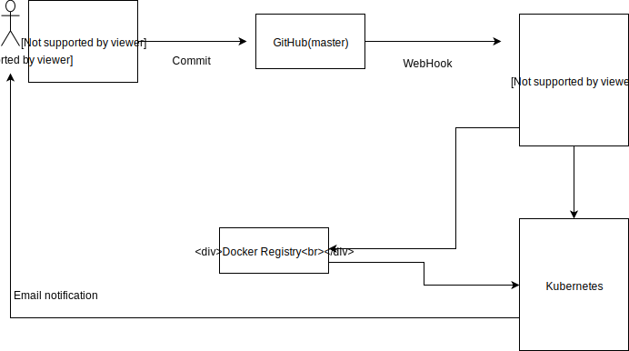

# Example Phoenix app

## Adding secrets
The `prod.secret.exs` and other `*.secret.exs` files will be stored in a seprarate private git repo named `<proj-name>-secrets`. These will be pulled by Travis and put in the `/var/<proj-name>-secrets` folder in the Docker container. Phoenix will be instructed to load them from there. **Add all your secrets in *.secret.exs**

The secrets about the location of the repo, and the credentials to access it will be encrypted secrets in Travis CI. See [here](https://docs.travis-ci.com/user/encryption-keys/) for more information.

# Hello

To start your Phoenix server:

  * Install dependencies with `mix deps.get`
  * Create and migrate your database with `mix ecto.create && mix ecto.migrate`
  * Install Node.js dependencies with `cd assets && npm install`
  * Start Phoenix endpoint with `mix phx.server`

Now you can visit [`localhost:4000`](http://localhost:4000) from your browser.

Ready to run in production? Please [check our deployment guides](http://www.phoenixframework.org/docs/deployment).

## Learn more

  * Official website: http://www.phoenixframework.org/
  * Guides: http://phoenixframework.org/docs/overview
  * Docs: https://hexdocs.pm/phoenix
  * Mailing list: http://groups.google.com/group/phoenix-talk
  * Source: https://github.com/phoenixframework/phoenix
